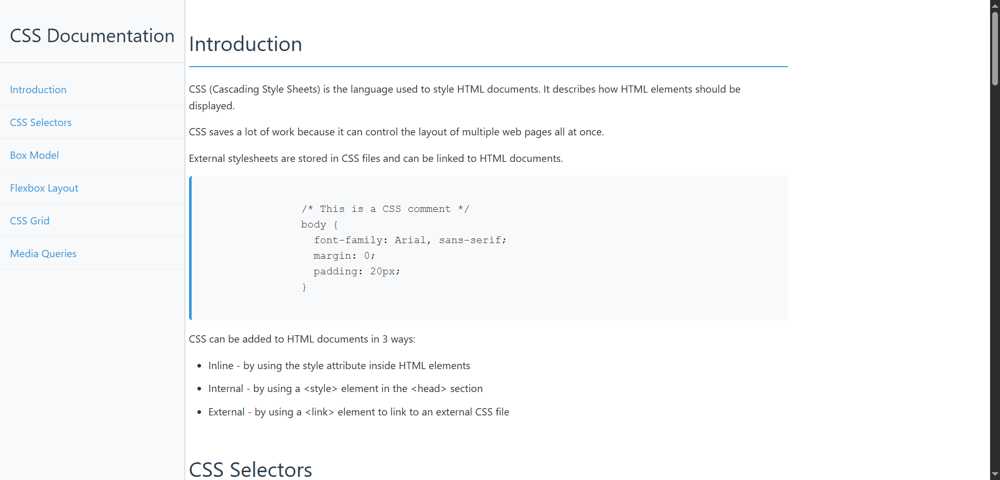

# Technical-Documentation

This is a Free Code Camp survey project for practicing Html, Css and JavaScript in the **Responsive Webdesign Curriculum.**



## Get Started

```bash
#First you need to clone this project
git clone https://github.com/Codeur-Omniscient/Technical-Documentation.git

#Change directory
cd Technical-Documentation
```

## Stack

- HTML
- CSS
